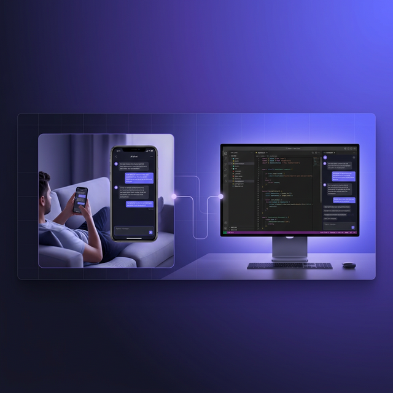
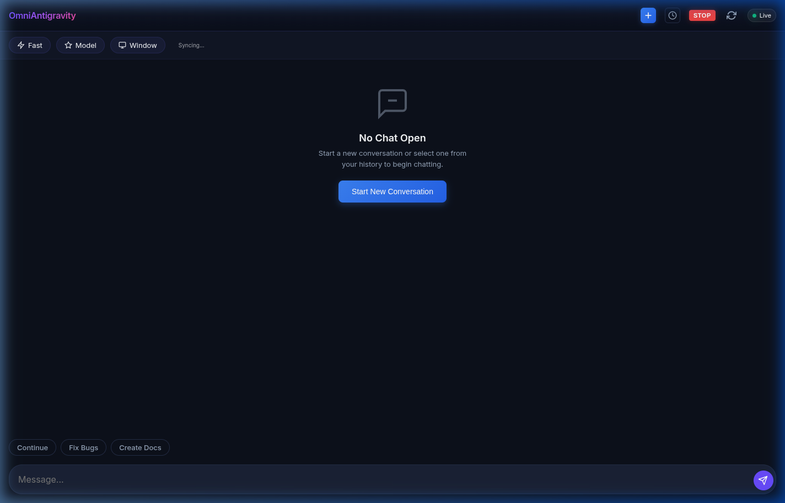
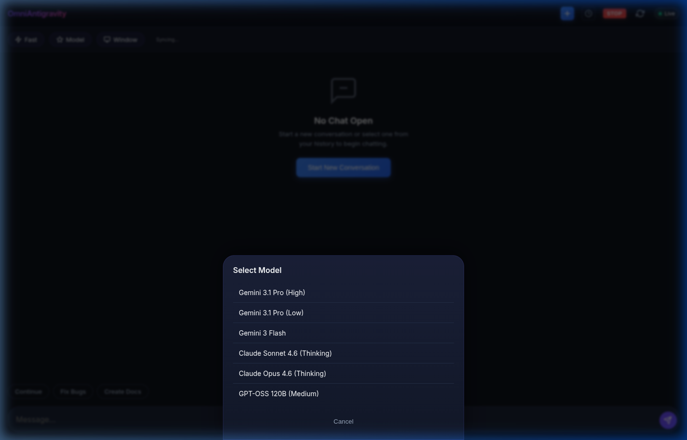
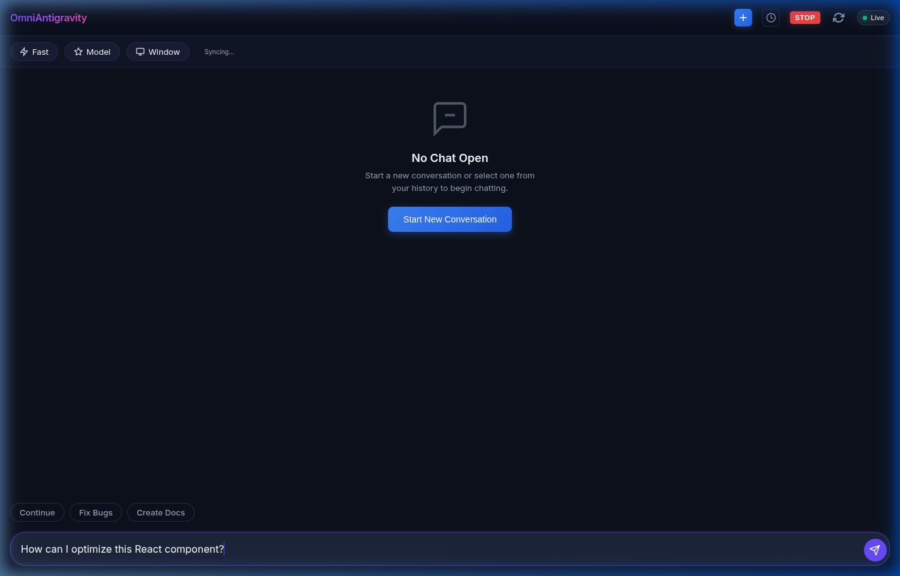

<div align="center">

# 📱 OmniAntigravity Remote Chat

### Your AI coding session shouldn't end when you leave your desk.

<br/>



<br/>
<br/>

   

[](https://www.npmjs.com/package/omni-antigravity-remote-chat) [](https://www.npmjs.com/package/omni-antigravity-remote-chat) [](https://hub.docker.com/r/diegosouzapw/omni-antigravity-remote-chat)

**Mirror your Antigravity (Windsurf) AI chat on your phone in real-time.**
<br/>
**Send messages. Switch models. Manage windows. All from your mobile browser.**

[Get Started](#-get-started) · [Screenshots](#-see-it-in-action) · [How It Works](#-how-it-works) · [Docker](https://hub.docker.com/r/diegosouzapw/omni-antigravity-remote-chat) · [npm](https://www.npmjs.com/package/omni-antigravity-remote-chat)

</div>

<br/>

## 😤 The Problem

You're deep into an AI-assisted coding session. Claude is generating code, Gemini is reviewing your architecture. Then your phone rings, someone needs you in the kitchen, or you just want to move to the couch.

**Your options today:**

- ❌ Walk back to the desk every time the AI responds
- ❌ Try to read your monitor from across the room
- ❌ Copy-paste into a separate mobile app (losing context)
- ❌ Just... stop coding

**There has to be a better way.**

## ✅ The Solution

OmniAntigravity mirrors your **entire Antigravity AI chat** to your phone — in real-time, with full interaction. Read responses, send follow-up messages, switch AI models, even manage multiple editor windows. All from your mobile browser.

```bash
npx omni-antigravity-remote-chat
```

That's it. Open the URL on your phone. You're in. 🚀

---

## 📸 See It in Action

<div align="center">

|                    Main Interface                    |                    Model Selection                     |                     Ready to Chat                     |
| :--------------------------------------------------: | :----------------------------------------------------: | :---------------------------------------------------: |
|  |  |  |
|            Premium dark UI with live sync            |           Switch between Gemini, Claude, GPT           |             Send messages from your phone             |

</div>

---

## ⚡ Get Started

### One command — zero config:

```bash
npx omni-antigravity-remote-chat
```

### Or install globally:

```bash
npm install -g omni-antigravity-remote-chat
omni-chat
```

### Or run with Docker:

```bash
docker run -d --name omni-chat \
  --network host \
  -e APP_PASSWORD=your_password \
  diegosouzapw/omni-antigravity-remote-chat:latest
```

### Prerequisite

Launch Antigravity in debug mode (one-time setup):

```bash
antigravity . --remote-debugging-port=7800
```

> 💡 **Pro tip:** Add `alias agd='antigravity . --remote-debugging-port=7800'` to your `~/.bashrc`

---

## 🏆 Why Developers Choose This

|     | Feature                | Details                                                       |
| --- | ---------------------- | ------------------------------------------------------------- |
| 🛋️  | **Code from anywhere** | Read and reply to AI chats from your couch, bed, or kitchen   |
| 🪟  | **Multi-window**       | Switch between multiple Antigravity instances from one phone  |
| 🔄  | **Real-time sync**     | < 100ms latency via WebSocket — chat updates appear instantly |
| 🤖  | **Model switching**    | Toggle between Gemini, Claude, GPT from a mobile dropdown     |
| 📋  | **Chat history**       | Browse and resume past conversations on mobile                |
| 🔒  | **Secure by default**  | HTTPS, password auth, cookie sessions, LAN auto-auth          |
| 🌐  | **Remote access**      | ngrok support with QR code — access from anywhere             |
| 🐳  | **Docker ready**       | One-liner container deployment                                |

---

## 📱 How It Works

```
┌─────────────┐    CDP (7800)    ┌──────────────┐    HTTPS/WS (4747)    ┌─────────────┐
│ Antigravity  │ ◄──────────────► │  Node Server  │ ◄──────────────────► │   Phone      │
│  (Desktop)   │    DOM snapshot   │  (server.js)  │    mirror + control  │  (Browser)   │
└─────────────┘                  └──────────────┘                      └─────────────┘
```

The server connects to Antigravity via the **Chrome DevTools Protocol (CDP)**, captures the chat DOM in real-time, and streams it to your phone over WebSocket. Actions on your phone (sending messages, switching models) are executed back on the desktop via CDP.

**Zero impact on your desktop** — the mirroring is read-only until you interact. No plugins, no extensions, no Antigravity modifications needed.

---

## 🪟 Multi-Window Management

Manage **multiple Antigravity instances** from a single phone:

- **Window Selector** — Tap 🖥️ to see all open Antigravity windows
- **Instant Switching** — Select any window, mirrors within 2 seconds
- **Smart Filtering** — Only shows real editor windows (hides Settings, Launchpad)
- **Launch Windows** — Spawn new Antigravity instances directly from your phone

---

## 🚀 Launch Modes

| Feature      | Git Clone             | NPM Global                          | Docker           |
| ------------ | --------------------- | ----------------------------------- | ---------------- |
| Basic server | `npm start`           | `omni-chat`                         | `docker run ...` |
| QR code      | `npm run start:local` | `omni-chat` (shows URL)             | —                |
| ngrok tunnel | `npm run start:web`   | `omni-chat` + `npx ngrok http 4747` | —                |
| SSL setup    | `npm run setup:ssl`   | Manual with `mkcert`                | Not needed       |

<details>
<summary>📖 Full launch mode details</summary>

### Git Clone (full control)

```bash
npm start              # Start server directly
npm run start:local    # Start with QR code for Wi-Fi access
npm run start:web      # Start with ngrok tunnel for internet access
npm run setup:ssl      # Generate trusted HTTPS certificates
```

### ngrok (Remote Access)

```bash
# Terminal 1
omni-chat

# Terminal 2
npx ngrok http 4747
```

> **Full ngrok integration** (automatic tunnel + QR code) is available via `npm run start:web` with `NGROK_AUTHTOKEN` in `.env`.

### SSL Setup

```bash
npm run setup:ssl
```

Auto-installs [mkcert](https://github.com/FiloSottile/mkcert), creates a local CA, and generates trusted certificates → green padlock 🔒

</details>

---

## 🔑 Configuration

```bash
cp .env.example .env
```

| Variable          | Default      | Description                 |
| ----------------- | ------------ | --------------------------- |
| `APP_PASSWORD`    | _(required)_ | Authentication password     |
| `PORT`            | `4747`       | Server port                 |
| `NGROK_AUTHTOKEN` | _(optional)_ | For remote access via ngrok |

---

## 🛠️ Troubleshooting

| Issue               | Solution                                                     |
| ------------------- | ------------------------------------------------------------ |
| "CDP not found"     | Launch Antigravity with `--remote-debugging-port=7800`       |
| "EADDRINUSE"        | Change `PORT` in `.env`, or stop the process using that port |
| Phone can't connect | Ensure same Wi-Fi network and check firewall                 |
| "Syncing..." stuck  | Wait 2-3s for CDP contexts to populate after window switch   |

---

## 📁 Project Structure

```
├── src/server.js          # Main server (Express + WS + CDP)
├── public/                # Mobile chat interface
├── launcher.js            # QR code + ngrok launcher
├── scripts/               # SSL, context menu installers
├── test/                  # Validation test suite
├── Dockerfile             # Docker support
└── .github/workflows/     # CI + auto-release + Docker Hub
```

---

## 📊 Star History

<a href="https://star-history.com/#diegosouzapw/OmniAntigravityRemoteChat&Date">
 <picture>
   <source media="(prefers-color-scheme: dark)" srcset="https://api.star-history.com/svg?repos=diegosouzapw/OmniAntigravityRemoteChat&type=Date&theme=dark" />
   <source media="(prefers-color-scheme: light)" srcset="https://api.star-history.com/svg?repos=diegosouzapw/OmniAntigravityRemoteChat&type=Date" />
   
 </picture>
</a>

---

## 🤝 Contributing

1. Fork the repository
2. Create your feature branch (`git checkout -b feature/amazing-feature`)
3. Commit your changes (`git commit -m 'Add amazing feature'`)
4. Push to the branch (`git push origin feature/amazing-feature`)
5. Open a Pull Request

See [CONTRIBUTING.md](CONTRIBUTING.md) for detailed guidelines.

---

## 🙏 Acknowledgments

Special thanks to **[Krishna Kanth B](https://github.com/krishnakanthb13)** — the original creator of the Windsurf mobile chat concept that inspired this project. OmniAntigravity builds upon that foundation with multi-window management, robust CDP handling, NPM/Docker packaging, and a premium mobile-first UI.

---

## 📄 License

GPL-3.0 — see [LICENSE](LICENSE) for details.

---

<div align="center">
  <sub>Built with ❤️ for developers who code from everywhere</sub>
  <br/>
  <sub><a href="https://github.com/diegosouzapw/OmniAntigravityRemoteChat">github.com/diegosouzapw/OmniAntigravityRemoteChat</a></sub>
</div>
