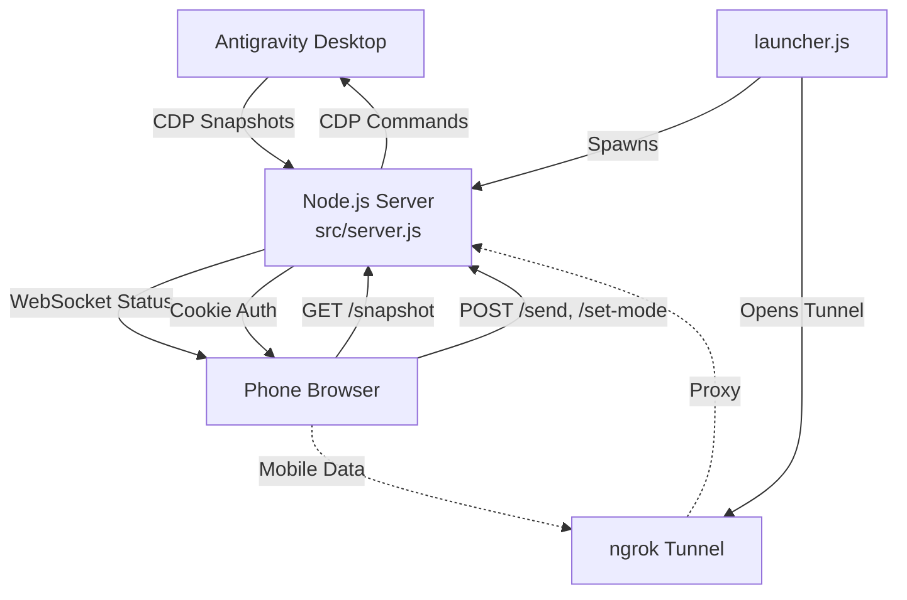

# CODE DOCUMENTATION — OmniAntigravity Remote Chat v0.5.2

## Project Structure

```text
omni-antigravity-remote-chat/
├── src/
│   ├── server.js                   # Main server (Express + WS + CDP actions)
│   ├── config.js                   # Constants, env vars, container IDs
│   ├── state.js                    # Shared mutable state + JSDoc typedefs
│   ├── ui_inspector.js             # Utility for inspecting Antigravity UI via CDP
│   ├── cdp/
│   │   └── connection.js           # CDP discovery, connect, init (discoverCDP, connectCDP)
│   └── utils/
│       ├── network.js             # getLocalIP, isLocalRequest, getJson
│       ├── process.js             # killPortProcess, isPortFree, launchAntigravity
│       └── hash.js                # hashString utility
├── public/
│   ├── index.html                  # Mobile-optimized web frontend
│   ├── login.html                  # Login page for web access
│   ├── css/
│   │   └── style.css               # Premium dark UI (indigo/purple gradient palette)
│   └── js/
│       └── app.js                  # Client-side logic (WebSocket, API calls, UI)
├── scripts/
│   ├── start.sh / start.bat        # Local launcher (Wi-Fi)
│   ├── start_web.sh / start_web.bat# Web launcher (ngrok tunnel)
│   ├── generate_ssl.js             # SSL certificate generator
│   └── install_context_menu.*      # OS context menu installers
├── docs/
│   ├── CODE_DOCUMENTATION.md       # This file
│   ├── DESIGN_PHILOSOPHY.md        # Architecture rationale
│   └── RELEASE_NOTES.md            # Legacy release notes (pre-0.3.0)
├── .github/
│   ├── workflows/ci.yml            # CI pipeline (Node 22+)
│   ├── ISSUE_TEMPLATE/             # Bug report & feature request templates
│   └── PULL_REQUEST_TEMPLATE.md    # PR template
├── launcher.js                     # Node.js entry point (QR, ngrok, env)
├── test/test.js                    # Validation test suite (25 checks)
├── Dockerfile                      # Docker support
├── package.json                    # Dependencies and scripts
├── .env.example                    # Environment template
├── CHANGELOG.md                    # Version history
└── README.md                       # Setup guide
```

## High-Level Architecture

The system acts as a "Headless Mirror" of the Antigravity session running on a Desktop machine. It utilizes the **Chrome DevTools Protocol (CDP)** to bridge the gap between a local Antigravity instance and a remote mobile browser.

### Data Flow



### Port Mapping

| Port     | Purpose                    |          Configurable          |
| :------- | :------------------------- | :----------------------------: |
| **7800** | Antigravity CDP debug port | `--remote-debugging-port` flag |
| **4747** | OmniAntigravity web server |        `PORT` in `.env`        |

## Core Modules

Since v0.5.2, the codebase follows a modular architecture.

### src/config.js — Constants & Configuration

Centralizes all constants, environment variables, and container IDs. Eliminates magic strings and numbers throughout the codebase.

### src/state.js — Shared State & Type Definitions

Manages shared mutable state with JSDoc `@typedef` for `CDPConnection`, `CDPTarget`, and `Snapshot`. Provides explicit setter functions for safe state mutation.

### src/utils/ — Utility Modules

| Module       | Functions                                            | Description                                          |
| :----------- | :--------------------------------------------------- | :--------------------------------------------------- |
| `network.js` | `getLocalIP`, `isLocalRequest`, `getJson`            | Network utilities for IP detection and HTTP requests |
| `process.js` | `killPortProcess`, `isPortFree`, `launchAntigravity` | OS process management and Antigravity launching      |
| `hash.js`    | `hashString`                                         | Simple hash utility for diff detection               |

### src/cdp/connection.js — CDP Connection

| Function           | Description                                                        |
| :----------------- | :----------------------------------------------------------------- |
| `discoverCDP()`    | Scans ports 7800-7803 to find Antigravity workbench target.        |
| `discoverAllCDP()` | Returns ALL CDP targets across all ports (multi-window support).   |
| `connectCDP()`     | Establishes CDP WebSocket with `pendingCalls` Map and 30s timeout. |
| `initCDP()`        | Orchestrates discovery → connection → context registration.        |

### src/server.js — CDP Action Functions

| Function                   | Description                                                                         |
| :------------------------- | :---------------------------------------------------------------------------------- |
| `captureSnapshot()`        | Injects JS into Antigravity to clone chat DOM, extract CSS, return HTML.            |
| `injectMessage()`          | Locates input field and simulates typing/submission via CDP.                        |
| `setMode()` / `setModel()` | Text-based selectors to change AI settings remotely.                                |
| `clickElement()`           | Deterministic targeting with occurrence index + leaf-node filtering.                |
| `remoteScroll()`           | Syncs phone scroll position to Desktop chat container.                              |
| `getAppState()`            | Syncs Mode/Model status and detects history visibility.                             |
| `startNewChat()`           | Triggers "New Chat" action on Desktop.                                              |
| `getChatHistory()`         | Scrapes Antigravity history panel for conversations.                                |
| `selectChat()`             | Switches desktop session to specific conversation.                                  |
| `hasChatOpen()`            | Verifies if editor and chat container are rendered.                                 |
| `startPolling()`           | Background loop with exponential backoff (2s→30s), heartbeat, CDP status broadcast. |
| `createServer()`           | Creates Express app with HTTP/HTTPS detection and auth middleware.                  |

## API Endpoints

| Endpoint         | Method | Description                                       |
| :--------------- | :----- | :------------------------------------------------ |
| `/login`         | POST   | Authenticates user and sets session cookie.       |
| `/logout`        | POST   | Clears session cookie.                            |
| `/health`        | GET    | Server status, CDP connection state, uptime.      |
| `/snapshot`      | GET    | Latest captured HTML/CSS snapshot.                |
| `/app-state`     | GET    | Current Mode (Fast/Planning) and Model.           |
| `/send`          | POST   | Sends a message to the Antigravity chat.          |
| `/stop`          | POST   | Stops current AI generation.                      |
| `/set-mode`      | POST   | Changes mode to Fast or Planning.                 |
| `/set-model`     | POST   | Changes the AI model.                             |
| `/new-chat`      | POST   | Starts a new chat session.                        |
| `/chat-history`  | GET    | List of recent conversation titles.               |
| `/select-chat`   | POST   | Switches to a selected conversation.              |
| `/chat-status`   | GET    | Status of chat container and editor.              |
| `/remote-click`  | POST   | Triggers click event on Desktop element.          |
| `/remote-scroll` | POST   | Syncs scroll position to Desktop.                 |
| `/cdp-targets`   | GET    | Lists all available CDP targets (multi-window).   |
| `/select-target` | POST   | Switches active CDP connection to another window. |
| `/ssl-status`    | GET    | HTTPS status and certificate info.                |
| `/generate-ssl`  | POST   | Generates SSL certificates via UI.                |
| `/debug-ui`      | GET    | Serialized UI tree for debugging.                 |
| `/ui-inspect`    | GET    | Detailed button and icon metadata.                |

## Security & Authentication

### Password Protection

- **Session Management**: Signed, `httpOnly` cookies via `omni_ag_auth`.
- **LAN Auto-Auth**: Local network IPs are auto-exempted for convenience.
- **WebSocket Auth**: Credentials verified during handshake.

### Web Access (ngrok)

- **Node.js Launcher**: `launcher.js` manages server + tunnel lifecycle.
- **QR Code**: Terminal QR for instant phone scanning.
- **Magic Links**: QR includes `?key=PASSWORD` for zero-typing auto-login.

### HTTPS/SSL

- **Auto-Detection**: Server checks `certs/server.key` and `certs/server.cert`.
- **Generation**: Run `node scripts/generate_ssl.js` or use UI button.
- **Hybrid**: Tries OpenSSL first, falls back to Node.js crypto.

## Auto-Reconnect (v0.3.1+)

- **Exponential Backoff**: 2s → 4s → 8s → max 30s, resets on success.
- **WebSocket Heartbeat**: Ping/pong every 30s to detect stale connections.
- **CDP Status Broadcasting**: Server sends `cdp_status` events to all mobile clients.
- **Mobile Toast**: Shows "⏳ Reconnecting..." and "✅ Connected!" notifications.

## Multi-Window Support (v0.4.0+)

- **Target Discovery**: `discoverAllCDP()` scans all ports for multiple Antigravity editor windows.
- **Smart Filtering**: Excludes internal pages (Settings, Launchpad, jetski) — only real workbenches shown.
- **Target Switching**: `POST /select-target` closes current connection and opens new one.
- **Retry Logic**: Frontend waits 2s for contexts, then retries snapshot loading up to 5x.
- **Mobile Selector**: "Window" chip in settings bar shows all detected windows.
- **Launch Windows**: `POST /api/launch-window` spawns new Antigravity instances.
- **Context Evaluation**: All CDP context loops (`hasChatOpen`, `getChatHistory`, `getAppState`, `selectChat`) skip non-matching contexts instead of returning prematurely.

## UX Improvements (v0.4.5+)

- **Force Expanded Sections**: All `<details>` and collapsible containers are forced open via CSS + JS.
- **Extended Scroll Lock**: 15-second protection prevents auto-scroll from fighting user interaction.
- **Transient 503 Protection**: `loadSnapshot()` doesn't trigger "No Chat Open" during window switching.

## Execution Flow

### Startup Sequence

1. **Start Antigravity in Debug Mode**

   ```bash
   antigravity . --remote-debugging-port=7800
   # Or use alias: agd
   ```

2. **Open or Start a Chat** in Antigravity

3. **Run the Server**

   ```bash
   npm start                 # Direct
   npm run start:local       # With QR code
   npm run start:web         # With ngrok tunnel
   ```

4. **Connect Your Phone** — Open URL shown in terminal

### Runtime Behavior

- **Snapshot Polling**: Every 1s, captures DOM if content hash changed
- **Delta Detection**: 36-char hash avoids redundant broadcasts
- **Scroll Sync**: Phone → Desktop only (prevents sync-fighting)
- **Graceful Shutdown**: Clean exit on Ctrl+C

## Dependencies

| Package         | Purpose                      |
| :-------------- | :--------------------------- |
| express         | HTTP/HTTPS server            |
| ws              | WebSocket real-time updates  |
| compression     | GZIP response compression    |
| cookie-parser   | Cookie-based auth sessions   |
| dotenv          | Environment variable loading |
| qrcode-terminal | Terminal QR code display     |

## CI Pipeline

GitHub Actions runs on every push/PR to `master`:

- **Test Matrix**: Node.js 18, 20, 22
- **Syntax Checks**: `node --check` on server.js, launcher.js, test.js
- **Test Suite**: Full 25-check validation (`npm test`)
- **File Structure**: Verifies all required files exist
